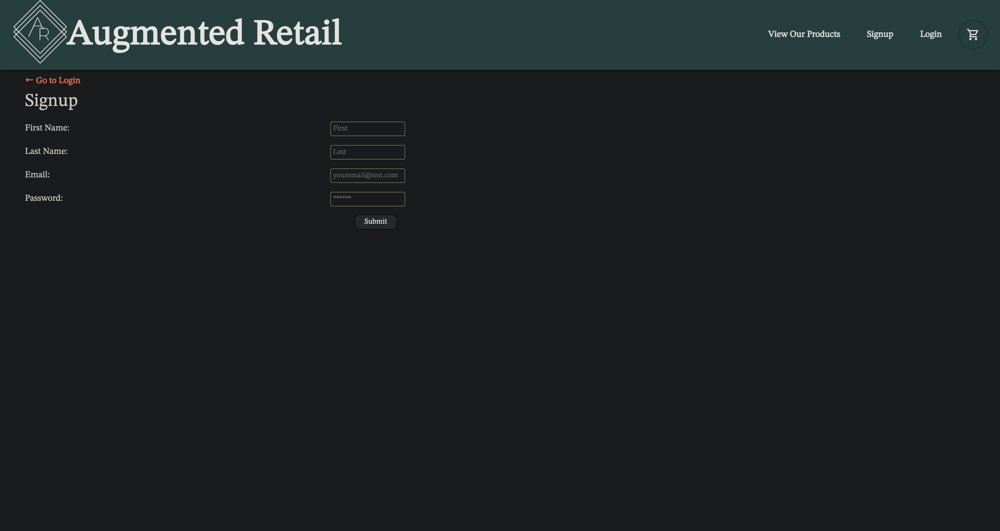
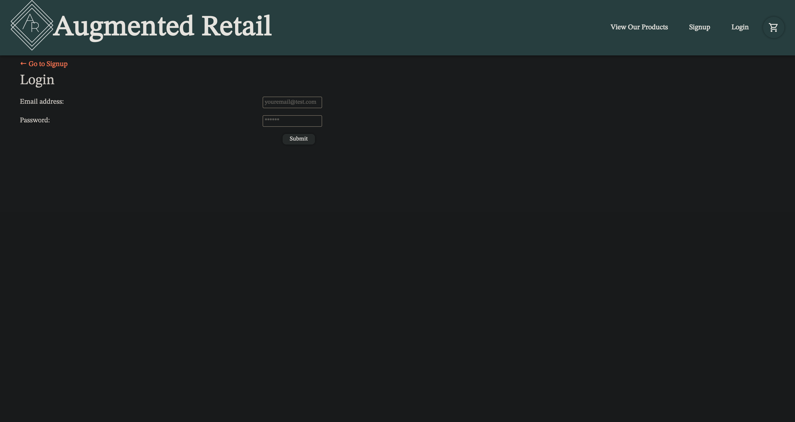
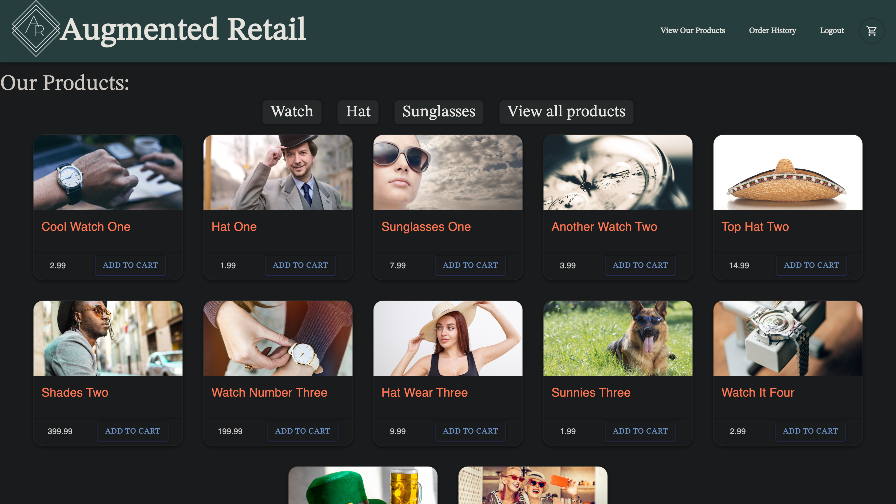
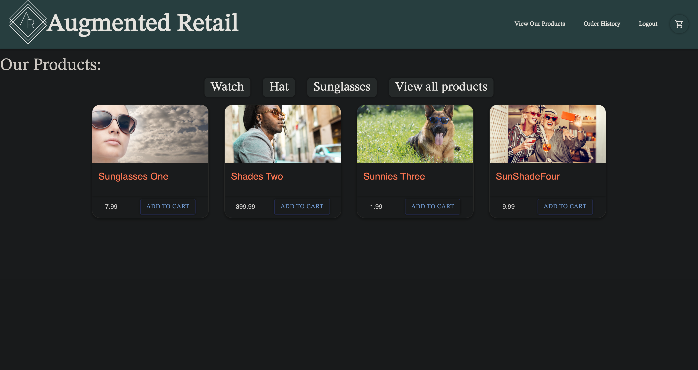
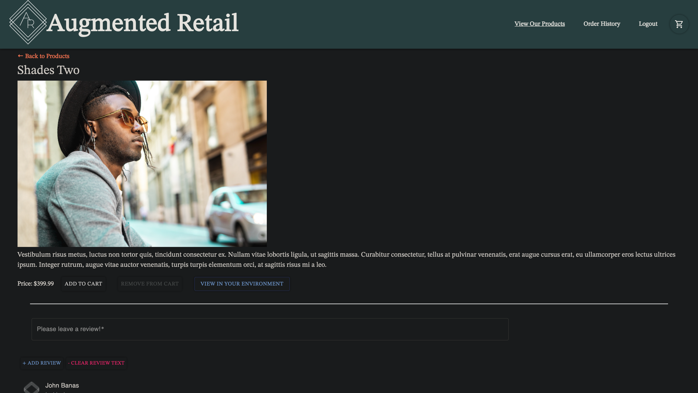
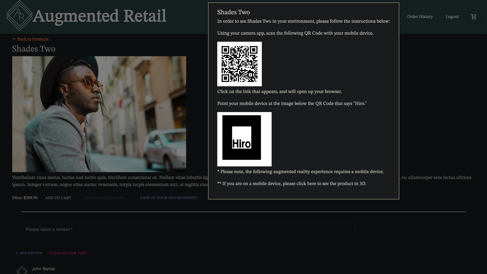
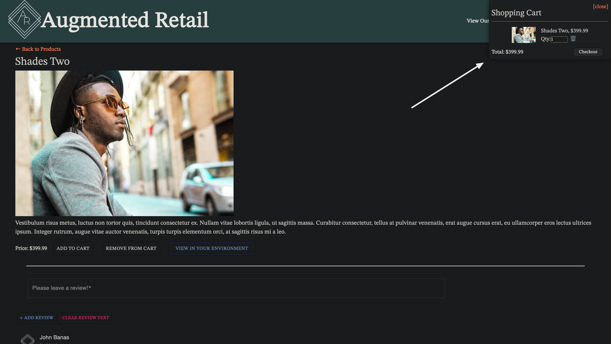
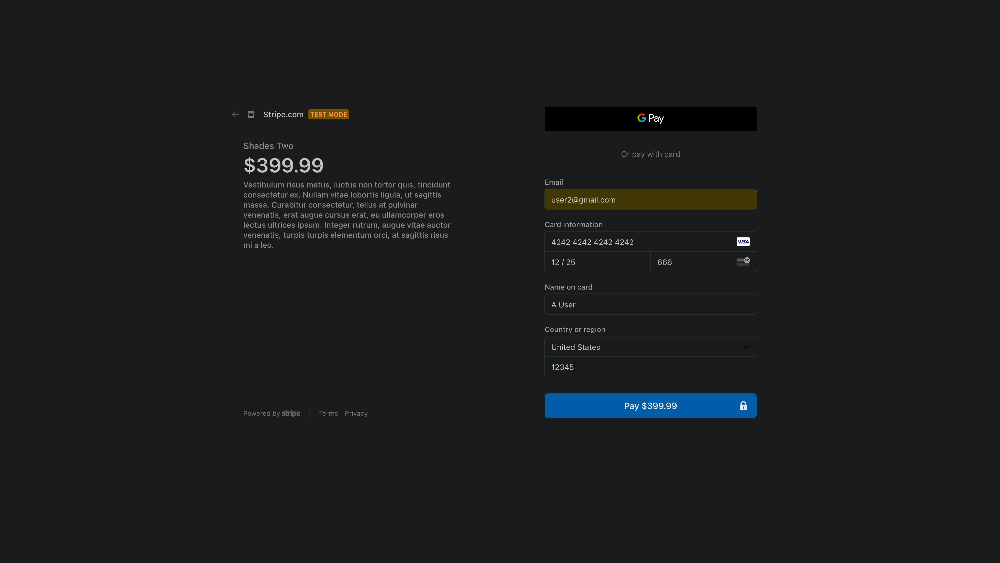
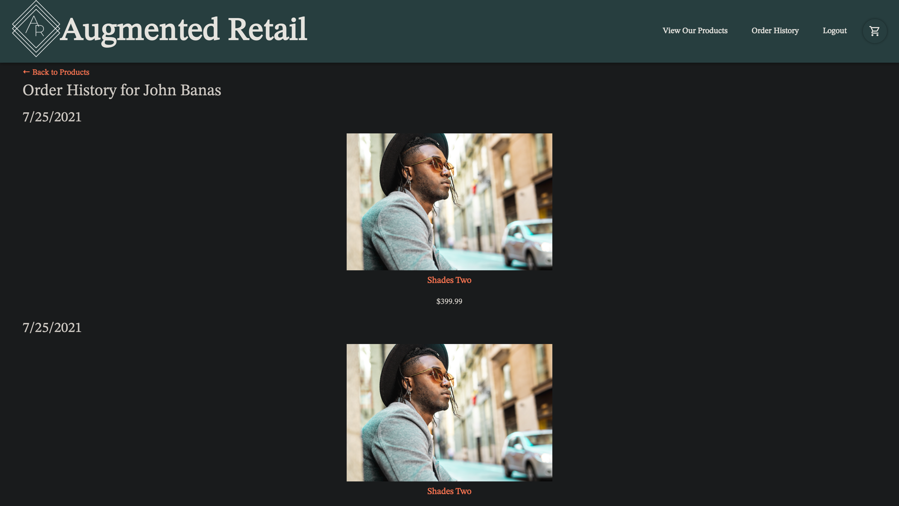

<h1 id="title">🎉 Augmented Retail 🎉</h1>

An ecommerce React application utilizing cutting edge technologies in: augmented reality, 3D rendering, database managment and so much more.

<h2>Table of Contents 📚<h2>

* [Landing Page](#landing)
* [Products Page](#products)
* [Product Details Page](#details)
* [Stripe Checkout](#checkout)
* [Video Walkthrough](#videoDemonstration)
* [Built With](#built)
* [Future Updates](#future)
* [Author](#author)
* [Contributions](#contribute)
* [Give Support](#Support)

<h2 id="landing">Landing Page 🛩️</h2>

When first loading the URL for Augmented Retail, you are taken to a landing page with the logo, a site title and a navigation bar. The navigation bar has options to Login, Sign Up, or to view a list of current products. You can also see a cart icon which will keep track of any products you wish to purchase. Below are images for the landing page, sign up, and login.

&nbsp

<h4>Landing Page</h4>

&nbsp

&nbsp

<h4>Sign Up</h4>

&nbsp

&nbsp

<h4>Login Page</h4>

&nbsp

&nbsp

Once you sign up, or login, you will see the navbar change to a different set of options. Now you can still view all the products, but you can also view your order history, or logout.

&nbsp

<h4>Signed In</h4>

&nbsp

&nbsp

<h2 id="products">Products 🛍️</h2> 

In the all of the products view, you will see a title of the product, an image of the product, the price of a product, and the ability to add a product to your cart. You can also choose to view the products by a specific category, and in the example below, we view the products by the sunglasses category. If you click on a product image, or title you are taken to that products details page.

&nbsp

<h4>View All Products</h4>

&nbsp

&nbsp

<h4>Single Category: Sunglasses</h4>

&nbsp

&nbsp

<h3 id="details">Product Details 😎</h3>

Once in the product details page, you gain access to write a review of a product, and see all posted reviews from other users as well. A description is available under the product image. You can add the product to your cart, and also remove it, should you change your mind. You can also access the QR code which takes you to a augmented reality view of the chosen product. Then a Hiro image which will allow you to see the image from your phone or webcam.

&nbsp

<h4>Product Details Page</h4>

&nbsp

&nbsp

<h4>View In Environment</h4>

&nbsp

&nbsp

<h4>Add To Cart</h4>

&nbsp

&nbsp

<h2 id="checkout">Checkout 💸</h2>

After deciding that you would like to purchase a product (or several products) simply click on the cart icon while logged in, and you can proceed to checkout through Stripe. Then after checking out, you are taken back to the view all products page. The navigation bar also gives you access to any past orders you have placed as well, in the link "Order History".

&nbsp

<h4>Checkout With Stripe</h4>

&nbsp

&nbsp

<h4>Order History</h4>

&nbsp

&nbsp

<!-- Still need a live walkthrough -->

<h2 id="videoDemonstration">Video Demonstration 📹</h2>  

[Live application walkthrough](https://www.awesomescreenshot.com/video/4606419?key=32f2a3908b51bc09f0bef4982ea86a69) 

&nbsp

<h2 id="built">Built With 🛠️</h2>

<ul>
<li><strong><a href="https://reactjs.org/">React.js</a></strong></li>
<li><strong><a href="https://www.mongodb.com/">MongoDB</a></strong></li>
<li><strong><a href="https://mongoosejs.com/">Mongoose.js</a></strong></li>
<li><strong><a href="https://www.apollographql.com/">Apollo</a></strong></li>
<li><strong><a href="https://graphql.org/">GraphQL</a></strong></li>
<li><strong><a href="https://material-ui.com/">Material UI</a></strong></li>
<li><strong><a href="https://nodejs.org/en/">Node.js</a></strong></li>
<li><strong><a href="https://www.npmjs.com/package/react-web-ar">React Web AR</a></strong></li>
<li><strong><a href="https://aframe.io/">A Frame</a></strong></li>
<li><strong><a href="https://threejs.org/">Three.js</a></strong></li>
<li><strong><a href="https://stripe.com/">Stripe</a></strong></li>
</ul>

&nbsp

<!-- future updates you would all like to see remove review, etc -->

<h2 id="future">Future Updates ⏳</h2>

- [ ] Currently the reviews for product can only be deleted in testing, would like to delete in UI as well.
- [ ] Currently the reviews for product do not auto-update when a new review is added.
- [ ] Create an administration user who can create/read/update/delete/ products, and users.
- [ ] Create 3D models for the specific products, instead of the globe rendering.
- [ ] Create a streamline mobile application with AR mapping software, so that QR and Hiro are unneccessary.
- [ ] What would you like to add to the application?

&nbsp

<h2 id="author">Authors 👋</h2>
<!-- Everyone put your info here
  **Your Name** follow mine for example -->

**John Patrick Banas**

- [GitHub Profile 🖥️](https://github.com/JohnBanas)
- [Email 📧](mailto:jbanas9124@gmail.com)
- [Portfolio 💼](https://johnbanas.github.io/portfolio/)

<!-- ****

- [GitHub Profile 🖥️](https://github.com/)
- [Email 📧](mailto:)
- [Portfolio 💼](#)

****

- [GitHub Profile 🖥️](https://github.com/)
- [Email 📧](mailto:)
- [Portfolio 💼](#)

-->
****
**Joshua Alexander Cross**

- [GitHub Profile 🖥️](https://github.com/joshacross)
- [Email 📧](mailto:joshuaalexandercross@gmail.com)
- [Portfolio 💼](https://joshacross.github.io/my-portfolio/)

****
**Casey Arrington**

- [GitHub Profile 🖥️](https://github.com/carrington13)
- [Email 📧](mailto:caseyarrington13@gmail.com)
- [Portfolio 💼](https://radiant-plains-18544.herokuapp.com/)
****
**Kevin Dallas Yatsinko**

- [GitHub Profile 🖥️](https://github.com/okni-c)
- [Email 📧](mailto:kevindyatsinko@gmail.com)
- [Portfolio 💼](https://kevindyatsinko.herokuapp.com/)

&nbsp

<h2 id="contribute">Contributions 💚</h2>

<!-- Each author in our group have a contribution paragraph -->

<h4>John Patrick Banas</h4>

None of this would be possible without the love and support of my wife Sam and our dog Teddy. Thank you to my nephew Mitchell for letting me help him with his homework, and through that, discover my love of computer science. The wonderful folks at the Vanderbilt Owen School of Engineering Bootcamp. All the Instructors, TA's, Graders, Tutors, and Admin team who made my journey possible. Also to all the coders out there who teach me something new everyday, through Slack, StackOverflow, GitHub, Dev, Codecademy, Coursera, CodeNewbie, Udemy, Dataquest, and too many others to name here. I am grateful for the knowledge freely given, and I will freely give knowledge in return. Thank you most of all, to <strong><em>YOU</em></strong> for reading this far! <strong>👏 🤣</strong>

&nbsp

<!-- <h4>Author</h4>

Put the people that made this happen here

&nbsp

<h4>Author</h4>

Put the people that made this happen here

&nbsp

<h4>Author</h4>

Put the people that made this happen here

&nbsp

<h4>Author</h4>

Put the people that made this happen here

&nbsp
 -->

<h2 id="support">Give Support 👏</h2>

If you would like to contribute, have any commentary, corrections, or suggestions, please feel free to contact us through our emails provided in the Authors section. If you like the project, we would appreciate giving a ⭐ in support.

[Back To Top of Page](#title)

